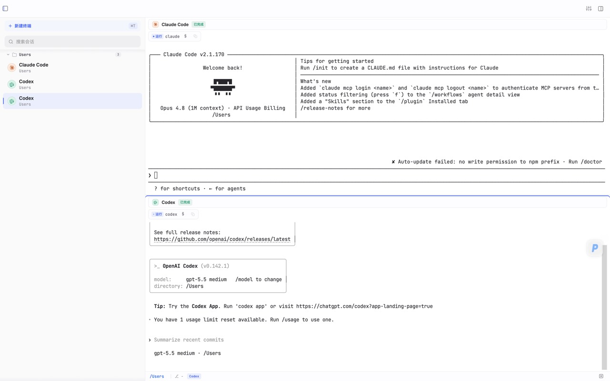
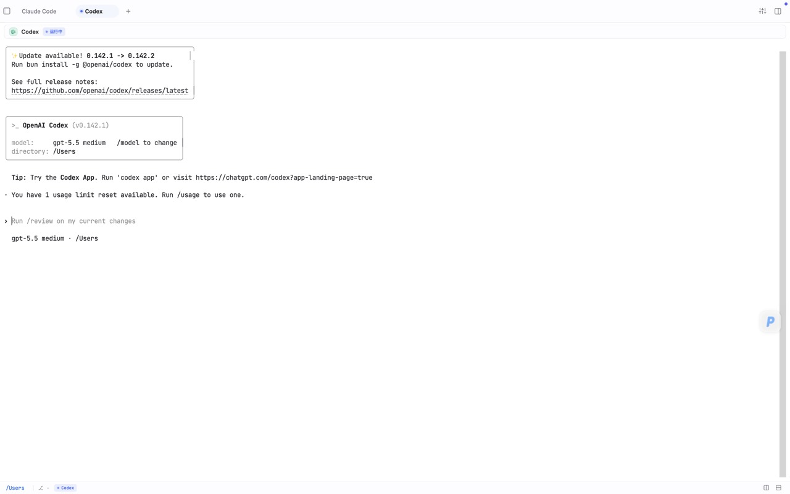
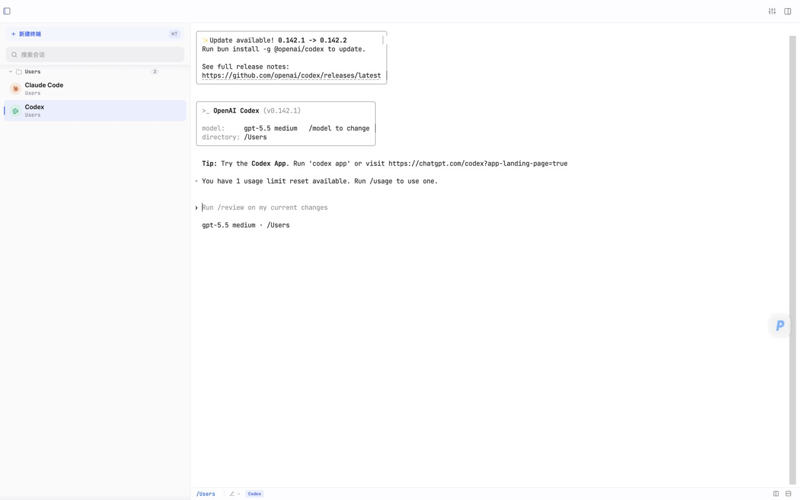
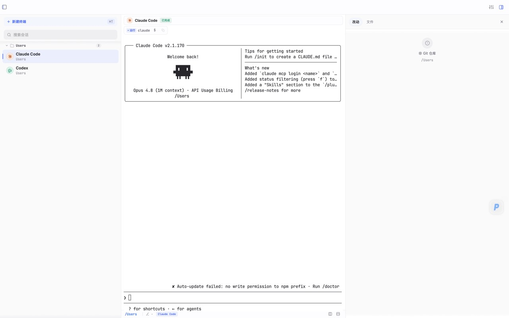

<p align="center">
  
</p>

<h1 align="center">Tunara</h1>

<p align="center">
  A lightweight, good-looking, AI-native sidebar terminal.
</p>

<p align="center">
  <strong>English</strong> · <a href="README.zh-CN.md">简体中文</a>
</p>

<p align="center">
  <a href="https://github.com/24kHandsome1201/tunara/releases/latest"></a>
  <a href="LICENSE"></a>
  
  
</p>

---

## Why this exists

Warp keeps adding features it doesn't need. It boots slowly, eats memory, and drifts further from being a terminal you reach for every day. cmux and Wave have the right instincts, but their styling is the kind you don't want sitting in your Dock. macOS Terminal and iTerm2 never grew a sidebar, so juggling several projects means a forest of tabs you switch through by muscle memory.

Tunara is built for that gap. A local terminal — **real PTY, xterm.js, WebGL** — no cloud, no account, no telemetry. A sidebar on the left groups local sessions by working directory and SSH sessions by host so a glance tells you which project or machine is running and which AI agent is in it. A read-only review rail on the right lets you eyeball your diff before you commit. The installer is about 30 MB and the app opens nearly instantly.

It is not a Warp replacement. It is for people who **switched back to iTerm and still feel something is missing**.

## Screenshots

<p align="center">
  
</p>

<p align="center">
  <em>A real terminal workspace with a smart session sidebar, agent detection, split panes, and a read-only review rail.</em>
</p>

| Focused terminal | Session sidebar | Review rail |
|------------------|-----------------|-------------|
|  |  |  |

## Core capabilities

### Terminal

The terminal is the product, not an accessory. Sessions run real `portable-pty`; the frontend uses xterm.js 6 with the WebGL renderer, so scrolling and bursty output stay smooth. Output is batched with `requestAnimationFrame` and protected by a two-layer backpressure budget (1 MiB PTY / 2 MiB frontend), so `cat`-ing a large log will not lock the UI.

- Multi-session PTYs; split any pane right or below, up to four panes
- ⌘F in-terminal search with match counts
- Command-block history follows live scrollback, with navigation and output filters for text / regex / case / invert / context lines
- Clickable URLs, configurable scrollback (1k–20k lines)
- OSC 7 cwd tracking, OSC 133 shell integration, OSC 9 / 99 / 777 notifications
- Drop files onto a local terminal to insert escaped paths (no auto-submit); SSH drops still upload over SFTP
- Export scrollback or a command block to a file (capped at 2000 lines / 256 KiB)
- Optional inline images (SIXEL / iTerm IIP)
- 9 synchronized interface & terminal color schemes: System, Light, Dark, GitHub Light, Rose Pine Dawn, Catppuccin, Tokyo Night, One Dark, Solarized

### Smart sidebar

The sidebar is what visually separates Tunara from every other terminal. Local sessions group by working directory and SSH sessions group by host; multiple sessions in the same project or on the same machine fold together; groups collapse, batch-close, and drag as a unit; sessions themselves rename, search, and fuzzy-match in place.

- Directory groups: collapse / expand / batch close
- Drag to reorder, fuzzy search filter, inline rename
- Unread indicator + explicit running-state marker
- Close-confirm guard: a running session needs a double click — no accidental kills mid-task
- Restores session list and UI layout across restarts

### Session management

Tunara keeps important sessions visible without turning the terminal into a project-management surface.

- Pinned sessions get a star marker and float higher in command-palette session results

Future direction, feature notes, and cost/value cuts live in [docs/ROADMAP.md](docs/ROADMAP.md), [docs/FEATURES.md](docs/FEATURES.md), and [docs/PRODUCT_REVIEW.md](docs/PRODUCT_REVIEW.md).

### SSH

Remote sessions use a long-lived russh connection, not a wrapper around `/usr/bin/ssh`. Host profiles store addresses and auth *preference* only — passwords and passphrases stay in memory for one connect.

- Explicit auth: SSH agent, one private key, password, or keyboard-interactive
- TOFU host-key prompts (`unknown` can be saved; `unverifiable` is session-only)
- Optional remote bash/zsh integration for cwd, command bounds, and agent state
- SFTP browse, search, grep, conflict-checked text saves, mkdir/rename/delete
- Batch upload/download with progress, cancel, and journaled recovery
- Read-only remote Git review over a one-shot exec channel
- Local and dynamic port forwarding, reconnect snapshots, connection diagnostics
- Saved and SSH-config hosts in a searchable online/offline server list

### Files and Inspector

The right rail is a contextual Inspector, not only a diff. Local and SSH files can open as workspace tabs beside the terminal.

- Tabs: Changes, Files, Preview; SSH adds Transfers and Forwarding
- Markdown/MDX reading and bounded single-file edits (UTF-8, ≤256 KiB, fingerprint-checked)
- Read-only Jupyter notebook preview (no code execution, no HTML/script/rich output)
- Safe image previews and bounded “view beginning” for oversized text/logs
- Workspace-bound Preview windows for loopback web apps (explicit SSH tunnel, no port scans)

### AI agent detection

Tunara's deepest lifecycle and resume integrations prioritize Claude Code, Codex, Cursor, and OpenCode. It also recognizes additional agent CLIs and shows their brand badge when their command is detected.

- First-class support: Claude Code, Codex, Cursor, and OpenCode; lifecycle and resume availability varies by CLI
- Basic command recognition: Amp, Gemini, Copilot, Droid, Pi, Auggie, Devin, and Aider
- Compact contextual strip shows detected agent and available runtime state
- File-change counts plus an entry point to review those changes when supported

What it explicitly does **not** do: bundled AI chat, model integration, MCP orchestration, agent launcher, or structured parsing of agent stdout. Tunara recognizes who is running. It does not run the agent for you.

### Review rail

The right pane is a read-only git diff for "one more look before commit" — the Inspector **Changes** tab. Reads go through git2 (zero-process overhead); writes always go through the system `git` CLI — meaning, **Tunara will never commit or push on your behalf**.

- Staged / Unstaged / Untracked, three-section layout
- Per-file diff preview with syntax highlighting; Markdown files can be read in Files
- One-click jump to an external editor: VS Code / Cursor / Zed / Sublime
- Graceful fallback for binary / oversized files
- Ahead / behind remote indicator

### Desktop experience

- ⌘K Command Palette with weighted ranking, covers every action and session switch
- Light/dark mode + system follow, 8 accent colors
- Pure Mode (⌘⇧P) hides chrome without tearing down PTYs
- Solid paper surfaces + native macOS overlay titlebar
- Toast notifications: exit animation, hover pause, progress bar
- Delayed signed-update reminders that stay silent until a release is actually available
- Settings tabs: Appearance, Shortcuts, Workflows, CLI, App
- Right-click menus on sessions, directory groups, and files
- Responsive layout: auxiliary panes overlay when the terminal would otherwise shrink below a usable width
- Window-state persistence (position, size)

## Install

### From a Release (recommended)

Grab the latest `.dmg` from [Releases](https://github.com/24kHandsome1201/tunara/releases/latest). Use the normal `Tunara_<version>_aarch64.dmg` for direct install. Only signed macOS Apple Silicon builds are supported for the direct installer.

Release pages may also include `Tunara_<version>_aarch64-legacy.dmg`. That is the previous manual install path for cases where Apple notarization is delayed; it is not used by Homebrew or the in-app updater and may require right-click Open in Finder.

### Homebrew

```bash
brew tap 24kHandsome1201/tunara https://github.com/24kHandsome1201/tunara
brew install --cask tunara
```

Use Settings > Advanced to check, install, and restart into a new release. Homebrew users can also update with `brew upgrade --cask tunara`.

### From source

```bash
pnpm install
pnpm tauri build
```

Prerequisites: Rust stable, Node 24+, pnpm 9+, plus the platform-specific [Tauri dependencies](https://tauri.app/start/prerequisites/).

**Platform support:** macOS on Apple Silicon is the supported release target.
Linux and Windows are experimental source-build targets: they receive no
official installer or complete native Preview guarantee. Linux CI checks the
shared compile and test surface, but it is not a release-support promise.

## Development

```bash
pnpm install          # install dependencies
pnpm tauri dev        # dev mode
pnpm build            # frontend build
pnpm typecheck        # type-check
pnpm test:node        # pure frontend logic and source-contract tests
pnpm test:ui          # happy-dom component tests
pnpm test             # all tests (Node + UI + Rust)
```

Deeper developer docs live under [`docs/`](docs/). Start with the [docs index](docs/README.md).

- [Features & code map](docs/FEATURES.md) — user-visible capabilities mapped to frontend and backend entry points.
- [Architecture](docs/ARCHITECTURE.md) — the frontend↔backend IPC surface: Tauri commands, the three transports (`invoke` / `Channel<PtyEvent>` / `git-changed` & `agent-hook` events), and managed state.
- [Testing](docs/TESTING.md) — the `.mjs`-imports-`.ts` pure-logic convention, UI component gate, Node/UI/Cargo split, and how to add a test.
- [Agent detection](docs/AGENT_DETECTION.md) — how agent detection & lifecycle work, plus a step-by-step checklist for adding a new agent.
- [State & persistence](docs/STATE_AND_PERSISTENCE.md) — the three Zustand stores, persisted workspace snapshot, and contributor gotchas around restore-on-restart.
- [Limited large-file viewing](docs/LIMITED_LARGE_FILE_VIEWING.md) — bounded first-N-line viewing for local and SSH text/log files, including IPC limits and safety behavior.

## Keybindings

Defaults below are macOS. Windows / Linux experimental builds remap several chords so they do not steal ordinary Ctrl sequences (for example command palette is Ctrl+Shift+K). All of these are editable in Settings > Shortcuts.

| Action | macOS default |
|--------|-----------------|
| New terminal | ⌘T (alternate ⌘N) |
| Close session | ⌘W |
| Split horizontal / vertical | ⌘D / ⌘⇧D |
| Focus adjacent pane | ⌘[ ⌘] ⌘⇧[ ⌘⇧] |
| Command Palette | ⌘K |
| Find in terminal | ⌘F |
| Quick select | ⌘⇧Space |
| Pure Mode | ⌘⇧P |
| Switch to session 1–8 / last | ⌘1 – ⌘8 / ⌘9 |
| Cycle recent sessions | ⌘Tab |
| Command-block prev / next | ⌘⇧↑ / ⌘⇧↓ |
| Jump to latest attention session | ⌘⇧U |
| Font size +/- / reset | ⌘+ / ⌘- / ⌘0 |
| Toggle sidebar / Inspector | ⌘\ / ⌘⇧\ |
| Settings | ⌘, |
| Global show / hide | ⌘⇧T |

## Stack

| Layer | Choice |
|-------|--------|
| Frontend | React 19, Zustand 5, xterm.js 6 + WebGL, Vite 7, TypeScript 6 |
| Backend | Tauri 2, Rust, portable-pty, russh, git2, tokio, which |
| Fonts | JetBrains Mono (UI / terminal / code), PingFang SC fallback |
| Build | pnpm 9 |

Final installer is around 30 MB, against Warp's ~150 MB.

## Layout

```
src/                    # React frontend
├── app/                # entry, init, keybindings, theme, shell layout
├── modules/            # terminal, ssh, fs, git, agent, editor, preview, …
├── state/              # Zustand (sessions + ui + workflows); persist I/O
├── styles/             # CSS tokens + terminal / shell themes
└── ui/                 # Sidebar, MainArea, Inspector, overlays

src-tauri/src/          # Rust backend
├── modules/
│   ├── pty/            # portable-pty session management
│   ├── ssh/            # russh, SFTP, transfer, forwarding, remote git
│   ├── git/            # git2 read-only operations
│   ├── fs/             # directory tree, search, grep, bounded head
│   ├── agent/          # CLI pre-check + hooks listener
│   ├── preview/        # tunneled preview webviews
│   ├── editor/         # external editor jump
│   ├── resolver/       # binary path resolution
│   └── process/        # subprocess management
└── lib.rs              # Tauri command registration
```

The full map, including Inspector tabs and IPC entry points, is in [docs/FEATURES.md](docs/FEATURES.md).

## Roadmap

1.0 shipped; mainline features were fully wrapped in 1.5.0 (terminal-block navigation / quick select / OSC 8 / Aider agent and more):

| Milestone | Status | Contents |
|-----------|--------|----------|
| M0 Store | done | Zustand stores + Tauri Store persistence |
| M1 Multi-session | done | Multi-PTY, sidebar grouping, tab navigation |
| M2 Agent | done | 12 agent CLIs auto-detected |
| M3 Git Diff | done | git2 + read-only review rail |
| P0 Split Pane | done | Horizontal / vertical split + draggable divider |
| P0 Session lifecycle | done | runState state machine + semantic state markers |
| P1 Persistence | done | Sessions + UI layout across restarts |
| P1 Sidebar titles | done | OSC 133 command / agent inference |
| P2 Command Palette | done | ⌘K, fuzzy match, weighted ranking |
| P3 Agent status bar | done | Contextual strip + change counts |
| Session Recovery | done (1.2) | xterm buffer snapshot + scrollback restore |
| SSH Client | done (1.7+) | russh long-lived conn, SFTP, transfers, host profiles, forwarding, diagnostics |
| Files / Preview | done (1.15–2.0) | workspace file tabs, Markdown safe-edit, notebook preview, Preview webviews |

See [CHANGELOG](CHANGELOG.md) and [docs/FEATURES.md](docs/FEATURES.md).

## Explicit non-goals

What we will not build matters as much as what we will. These are off the roadmap, and PRs adding them will not be merged:

- Bundled AI chat / model integration / MCP orchestration
- Agent catalog, agent launcher, batch-launch entry points
- Structured parsing of agent stdout, persistent Agent event history/search, or a rich Agent timeline
- Stage / commit / push or any write operations in the DiffPanel
- Plugin system, custom renderer, unbounded recursive tile splits (hard cap: 4 panes)
- Telemetry, analytics, any kind of phone-home

The test is simple: keep the terminal a terminal, not the next IDE or the next agent console.

## Contributing

Bug fixes, new agent detection, and new terminal themes are welcome. For anything larger, please open an Issue first. See [CONTRIBUTING](CONTRIBUTING.md) and [CODE_OF_CONDUCT](CODE_OF_CONDUCT.md).

Security issues go through the private channel described in [SECURITY](SECURITY.md) — please do not open a public Issue.

## Credits

- The project began from the [terax-ai-tauri-terminal](https://github.com/emee-dev/terax-ai-tauri-terminal) Tauri + xterm scaffold, and has been fully rewritten since. Original copyright and license: [THIRD_PARTY_NOTICES](THIRD_PARTY_NOTICES.md).
- Terminal core thanks to [xterm.js](https://xtermjs.org/), [portable-pty](https://github.com/wez/wezterm/tree/main/pty), and [git2-rs](https://github.com/rust-lang/git2-rs).
- Desktop shell thanks to [Tauri](https://tauri.app/).

## License

[Apache-2.0](LICENSE)
