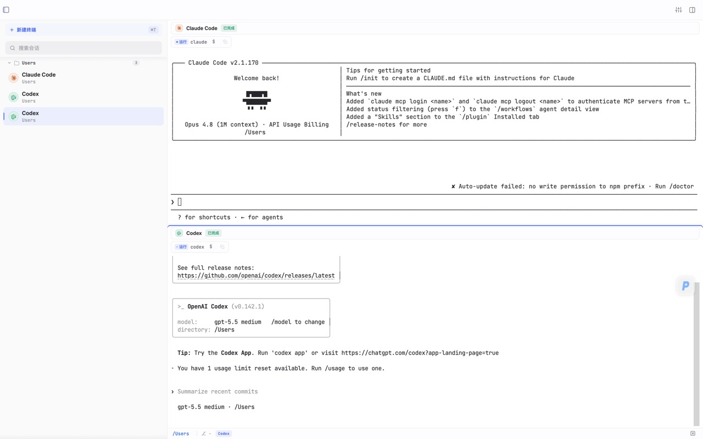
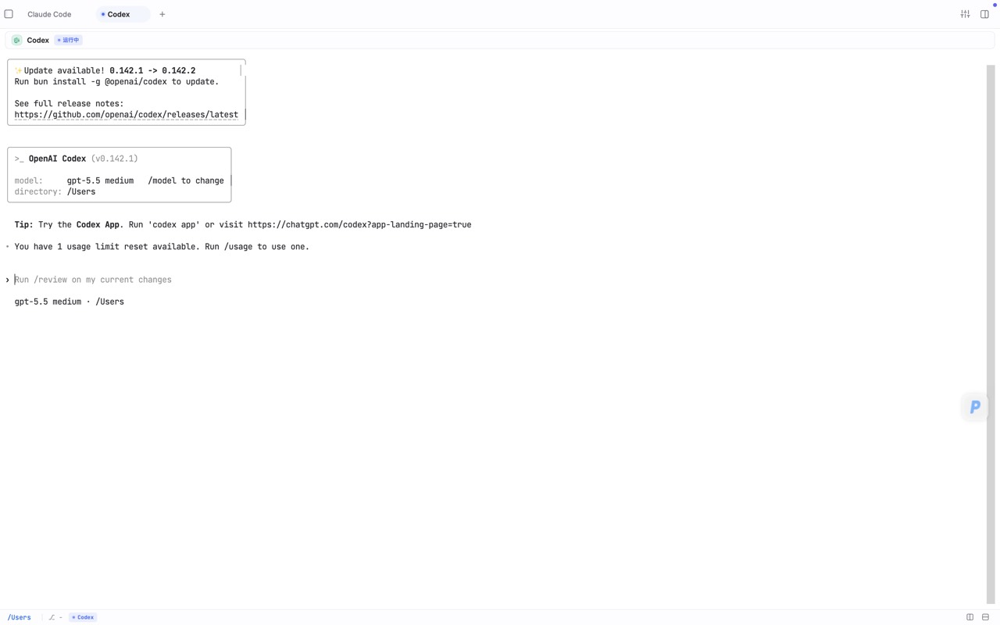
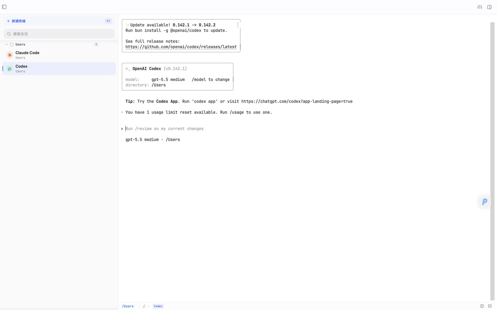
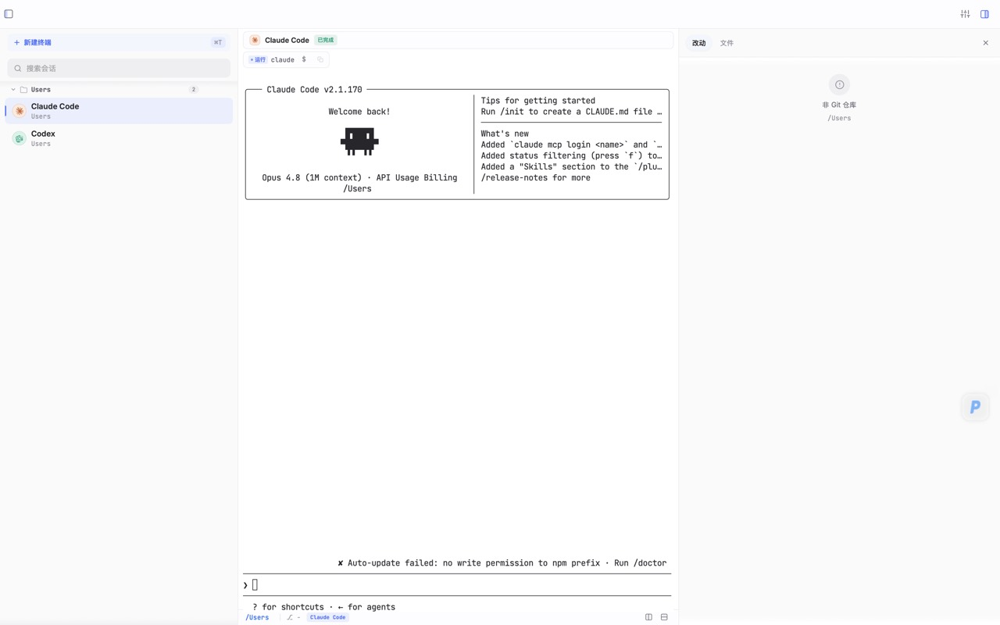

<p align="center">
  
</p>

<h1 align="center">Tunara</h1>

<p align="center">
  轻量好看的 AI 原生侧栏终端
</p>

<p align="center">
  <a href="README.md">English</a> · <strong>简体中文</strong>
</p>

<p align="center">
  <a href="https://github.com/24kHandsome1201/tunara/releases/latest"></a>
  <a href="LICENSE"></a>
  
  
</p>

---

## 为什么有这个项目

Warp 想做的事太多，启动慢、内存占用高，离一个"每天打开就用"的终端越来越远。cmux、Wave 这类新工具方向是对的，但样式做得让人不太想留它在 Dock。系统自带的 Terminal 和 iTerm2 一直没有侧栏，多个项目同时跑就只能开十几个 tab，靠肌肉记忆切换。

Tunara 就是冲着这个空当来的。一个本地终端，**真实 PTY、xterm.js、WebGL**，没有云、没有账号、没有埋点。左边一条侧栏按工作目录把会话分好组，看一眼就知道哪个项目在跑、跑的是哪个 AI agent。右边一条只读 review 面板，让你在 commit 之前快速过一遍 diff。安装包大约 30 MB，启动几乎瞬开。

它不是 Warp 的替代品。它是给那些**装回 iTerm 又总觉得缺点什么**的人准备的。

## 截图

<p align="center">
  
</p>

<p align="center">
  <em>真实终端工作区，带智能会话侧栏、agent 识别、分栏和只读 review 面板。</em>
</p>

| 聚焦终端 | 会话侧栏 | Review 面板 |
|----------|----------|-------------|
|  |  |  |

## 核心能力

### 终端

终端是主角，不是配件。跑的是真实 `portable-pty`，前端用 xterm.js 6 加 WebGL renderer，滚动和大批量输出都不掉帧。输出经过 RAF 合批和双层背压（PTY 1MiB / 前端 2MiB），即使 `cat` 一个大日志也不会卡住界面。

- 多会话 PTY，水平/垂直分栏，最深 2 pane（不做递归 tile，保持可预测）
- ⌘F 终端内搜索 + 匹配计数
- 命令块输出筛选：文本 / 正则 / 大小写 / 反选 / 上下文行
- 可点击 URL，可配置 scrollback（1k 到 20k 行）
- OSC 7 跟踪 cwd，OSC 133 接 shell integration
- 7 套终端配色：default、catppuccin、tokyo-night、one-dark、solarized、github-light、rose-pine-dawn

### 智能侧栏

侧栏是 Tunara 跟其他终端最直观的区别。会话按工作目录自动分组，进同一个项目下的多个会话会折叠到一起；目录组可以折叠、批量关闭、整组拖动；会话本身可以重命名、搜索、模糊匹配。

- 目录组折叠 / 展开 / 批量关闭
- 拖拽排序，搜索过滤（fuzzy），就地重命名
- Unread 指示器 + 运行状态脉动
- 关闭确认：running 状态需要双击，避免误关跑到一半的任务
- 跨重启恢复会话列表和 UI 布局

### 工作区驾驶舱

Tunara 新增了一层轻量驾驶舱，适合一天里同时开着多个会话、多个 agent、多个项目的人。它帮你看清当前状态，标出重点会话，还能把临时想法直接记在会话里。

- Workspace Radar 汇总会话、AI agent、未读输出、远程连接、Git 改动和可清理的已完成任务
- Focus Quest 把当前工作区状态变成一个小小的下一步清单
- 会话概览卡片集中展示 cwd、agent、Git、笔记和常用操作
- Session Notes 提供自动保存的会话草稿、任务计数和橡皮鸭模板
- 置顶会话会显示星标，并在命令面板的会话结果里排得更靠前
- 起步工作流可以一键加入 review、清理和排查类常用命令

后续方向和功能记录在 [docs/ROADMAP.md](docs/ROADMAP.md)。

### AI Agent 识别

如果你日常用 Claude Code、Codex、Aider 这些命令行 agent，Tunara 会自动认出来并在会话上挂一个品牌角标。不需要配置，启动时 PTY 一旦匹配到 agent 命令就生效。

- 自动识别 12 种 agent CLI：Claude Code、Codex、Amp、Gemini、Copilot、Cursor、Droid、OpenCode、Pi、Auggie、Devin、Aider
- 顶部浮条显示 agent 状态：starting / idle / running
- Agent hooks 监听结构化生命周期事件（启动、思考中、工具调用、结束）
- Agent 改动文件计数 + 改动文件预览入口

明确不做：内置 AI 聊天、模型接入、MCP 编排、agent 启动器、agent stdout 结构化解析。Tunara 只是认出谁在跑，不替你管 agent。

### Review 面板

右栏是只读的 Git diff，给你"在 commit 之前再看一眼"用。读 git 走 git2（零进程开销），写永远走系统 `git` CLI，也就是说，**Tunara 自己永远不会替你 commit 或 push**。

- Staged / Unstaged / Untracked 三段式分区
- 文件浏览器 + 代码预览，语法高亮 + Markdown 渲染
- 一键跳转外部编辑器：VS Code / Cursor / Zed / Sublime
- 二进制 / 超大文件友好降级
- Ahead/Behind 远程状态展示

### 桌面体验

- ⌘K Command Palette，权重排序，覆盖所有动作和会话切换
- 深浅色模式 + 跟随系统，5 色 accent
- macOS 毛玻璃 + 自定义标题栏
- Toast 通知：退出动画、hover 暂停、进度条
- 右键菜单覆盖会话、目录组、文件
- 响应式布局：窄窗自动收起侧栏 / 右栏
- 窗口状态持久化（位置、尺寸）

## 安装

### 从 Release 下载（推荐）

到 [Releases](https://github.com/24kHandsome1201/tunara/releases/latest) 下载最新版的 `.dmg`。普通用户请用默认的 `Tunara_<version>_aarch64.dmg` 直接安装；当前仅支持签名的 macOS Apple Silicon 构建。

Release 页面也可能带 `Tunara_<version>_aarch64-legacy.dmg`。这是保留旧行为的手动安装包，用于 Apple 公证延迟时兜底；它不用于 Homebrew 或应用内自动更新，首次打开可能需要在 Finder 里右键打开。

### Homebrew

```bash
brew tap 24kHandsome1201/tunara https://github.com/24kHandsome1201/tunara
brew install --cask tunara
```

升级走应用内 Tauri updater，不需要 `brew upgrade`。

### 从源码构建

```bash
pnpm install
pnpm tauri build
```

前置：Rust stable、Node 20+、pnpm 9+，加上平台对应的 [Tauri 依赖](https://tauri.app/start/prerequisites/)。

## 开发

```bash
pnpm install          # 装依赖
pnpm tauri dev        # 开发模式
pnpm build            # 前端构建
pnpm typecheck        # 类型检查
pnpm test             # 全部测试（Node + Rust）
```

更深入的开发者文档在 [`docs/`](docs/)：

- [架构 Architecture](docs/ARCHITECTURE.md) —— 前后端 IPC 全貌：所有 Tauri 命令、三种传输（`invoke` / `Channel<PtyEvent>` / `git-changed` 与 `agent-hook` 事件）、以及被托管的 state 对象。
- [测试 Testing](docs/TESTING.md) —— `.mjs` 直接 import `.ts` 的纯逻辑约定、源码断言风格、Node + Cargo 分工，以及如何加测试。
- [Agent 识别](docs/AGENT_DETECTION.md) —— agent 识别与生命周期原理，以及新增一个 agent 的分步清单。
- [状态与持久化 State & persistence](docs/STATE_AND_PERSISTENCE.md) —— Zustand 双 store、持久化的 workspace 快照，以及恢复重启相关的注意点。

## 快捷键

| 操作 | macOS | Windows / Linux |
|------|-------|-----------------|
| 新建终端 | ⌘T | Ctrl+T |
| 关闭会话 | ⌘W | Ctrl+W |
| 水平分栏 | ⌘D | Ctrl+D |
| 垂直分栏 | ⌘⇧D | Ctrl+Shift+D |
| 切换 pane 焦点 | ⌘] / ⌘[ | Ctrl+] / Ctrl+[ |
| Command Palette | ⌘K | Ctrl+K |
| 终端内搜索 | ⌘F | Ctrl+F |
| 切到第 N 个会话 | ⌘1 ~ ⌘9 | Ctrl+1 ~ Ctrl+9 |
| 字号 +/- | ⌘+ / ⌘- | Ctrl++ / Ctrl+- |
| 切换侧栏 | ⌘\ | Ctrl+\ |
| 设置 | ⌘, | Ctrl+, |

## 技术栈

| 层 | 选型 |
|----|------|
| 前端 | React 19、Zustand 5、xterm.js 6 + WebGL、Vite 7、TypeScript 5.8 |
| 后端 | Tauri 2、Rust、portable-pty、git2、tokio、which |
| 字体 | Inter Variable（UI）、JetBrains Mono（终端 / 代码） |
| 构建 | pnpm 9 |

最终安装包大约 30 MB，对比 Warp 的 150 MB 量级。

## 目录结构

```
src/                    # React 前端
├── app/                # 入口、初始化、快捷键、主题
├── modules/            # terminal / git / fs / agent / editor
├── state/              # Zustand（sessions + ui + persist）
├── styles/             # CSS tokens + 终端配色
└── ui/                 # Sidebar、MainArea、DiffPanel 等组件

src-tauri/src/          # Rust 后端
├── modules/
│   ├── pty/            # portable-pty 会话管理
│   ├── git/            # git2 只读操作
│   ├── fs/             # 目录树、搜索、grep
│   ├── agent/          # CLI 预检 + hooks 监听
│   ├── editor/         # 外部编辑器跳转
│   ├── resolver/       # 二进制路径解析
│   └── process/        # 子进程管理
└── lib.rs              # Tauri 命令注册
```

## 路线图

1.0 已发布，主线功能在 1.5.0 全面收口（终端块导航 / quick select / OSC 8 / Aider agent 等）：

| 里程碑 | 状态 | 内容 |
|--------|------|------|
| M0 Store | done | Zustand 双 store + Tauri Store 持久化 |
| M1 多会话 | done | 多 PTY、侧栏分组、tab 导航 |
| M2 Agent | done | 12 种 agent CLI 自动检测 |
| M3 Git Diff | done | git2 + 只读 review 面板 |
| P0 Split Pane | done | 水平 / 垂直分栏 + 拖拽分割线 |
| P0 Session 生命周期 | done | runState 状态机 + 脉动动画 |
| P1 持久化 | done | 会话 + UI 布局跨重启 |
| P1 侧栏标题 | done | OSC 133 命令 / agent 推导 |
| P2 Command Palette | done | ⌘K、模糊匹配、权重排序 |
| P3 Agent 状态条 | done | 浮条 + 改动计数 |
| Session Recovery | done (1.2) | xterm buffer 快照 + 滚动恢复 |
| SSH Client | done (1.7) | russh 长连接、SFTP 浏览 + 下载、主机 profile、可选远程 shell 集成 |

详见 [CHANGELOG](CHANGELOG.md)。

## 明确不做

跟"做什么"同样重要。下面这些功能在路线图之外，PR 也不会被合并：

- 内置 AI 聊天 / 模型接入 / MCP 编排
- Agent catalog、agent 启动器、批量启动入口
- Agent stdout 结构化解析、Agent 改动时间线
- DiffPanel 里的 stage、commit、push 等写操作
- 插件系统、自研渲染、递归 tile 分栏
- 遥测、analytics、任何回传数据

判断标准很简单：让终端继续是终端，而不是变成下一个 IDE 或下一个 agent 控制台。

## 贡献

欢迎 Bug 修复、新 agent 识别、新终端配色。非小改动请先开 Issue 讨论。详见 [CONTRIBUTING](CONTRIBUTING.md) 和 [CODE_OF_CONDUCT](CODE_OF_CONDUCT.md)。

安全问题请走 [SECURITY](SECURITY.md) 里说的私有渠道，不要直接开 Issue。

## 致谢

- 项目最早从 [terax-ai-tauri-terminal](https://github.com/emee-dev/terax-ai-tauri-terminal) 的 Tauri + xterm 脚手架起步，后续完全重写。原始版权与许可见 [THIRD_PARTY_NOTICES](THIRD_PARTY_NOTICES.md)。
- 终端核心来自 [xterm.js](https://xtermjs.org/)、[portable-pty](https://github.com/wez/wezterm/tree/main/pty)、[git2-rs](https://github.com/rust-lang/git2-rs)。
- 桌面壳来自 [Tauri](https://tauri.app/)。

## 许可证

[Apache-2.0](LICENSE)
