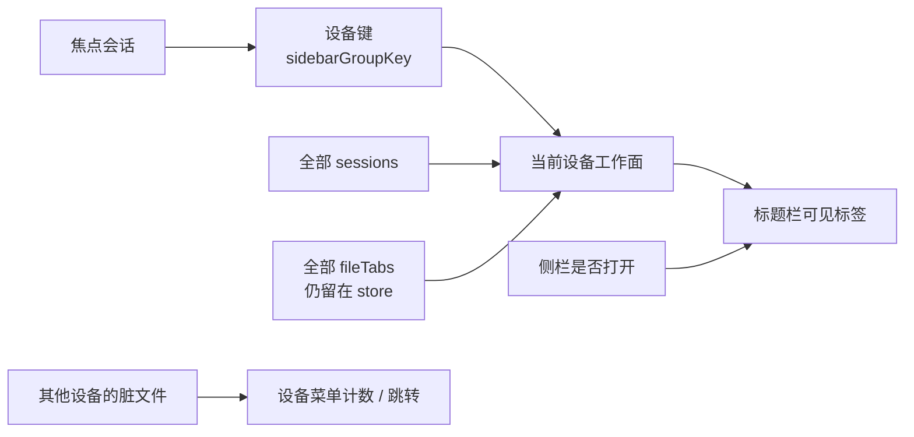

# 标题栏标签：按设备收口

本文是标题栏工作面的设计与落地说明。**阶段 A–D 已落地**；用户可见合同以 [FEATURES.md](./FEATURES.md) 为准。产品原则以 [GOAL.md](./GOAL.md) 为准。侧栏已经按设备分组，见 [SIDEBAR_SSH.md](./SIDEBAR_SSH.md)。下文保留设计动机与示意图，方便对照实现。

---

## 0. 结论

**标题栏只展示当前设备的工作面，不把所有设备的终端和文件铺成一条混合带。** 对照见下方示意图。 对照见下方示意图。

- **设备**沿用侧栏组键：`local:<dir>` 或 `ssh:<user>@<host>:<port>`。不要另造一套「窗口 / 空间 / Chrome 分组」。
- **侧栏是跨设备定位器。** 标题栏是当前设备上「打开了哪些壳、正在看哪些文件」。
- **区分传输，不并列设备。** SSH 标签用来源标记（现有 ⇄）和完整 tooltip/ARIA；不要靠给每个标签上色来假装分组。
- **侧栏打开时不要再倒一遍全部终端标签。** 有文件打开时把所有会话塞进标题栏，是今天最主要的重复与混淆。
- **未保存的外设备文件不能消失。** 默认不进当前条，但设备菜单上要有脏计数和跳转。

一句话：VS Code Remote 用整窗表示一台机器；Tunara 的差异化是**同一窗口里同时活着本地和多台 SSH**。标题栏若再做成「所有东西的第二份列表」，侧栏按主机分组的收益会被吃掉。

---

## 示意图

下面用同一套窗口库存把「今天 / 推荐 / 否决」画完。后文的规则都可以对照这些图。

**库存（三台设备同时活在一个窗口里）：**

```
本地  ~/src/app          壳 app、Claude Code     文件 notes.txt
SSH   tuna@pi            壳 pi                   文件 /etc/hosts
SSH   alice@prod         壳 prod                 文件 README.md ●未保存
```

默认「当前」= 焦点在 `tuna@pi`，主区正在看 `hosts`。

### 图 1 · 三层各管一层

```
┌──────────────────────────────────────────────────────────────────┐
│ 标题栏   当前设备的工作面                                        │
│          打开了哪些文件；侧栏收起时再加上这台机器的壳            │
├────────────┬─────────────────────────────────┬───────────────────┤
│ 侧栏       │ 主区                            │ 检查器            │
│ 有哪些设备 │ 当前这一个面                    │ 当前会话的        │
│ 有哪些壳   │ 一个终端 或 一个文件            │ 只读上下文        │
└────────────┴─────────────────────────────────┴───────────────────┘
```

侧栏已经按主机分组。标题栏不要再当第二份定位器。

### 图 2 · 今天：侧栏开着，文件一开就把所有设备倒进标题栏

```
┌ 今天 ────────────────────────────────────────────────────────────┐
│ ⬤⬤⬤ [≡] [app] [Claude] [pi] [prod] [notes.txt] [hosts] [README.md●] [+]  纯净 ⚙ ▥ │
├──────────┬───────────────────────────────────────┬───────────────┤
│ ~/src/app│                                       │ Files         │
│   app    │         hosts                         │ tuna@pi       │
│   Claude │         （主区只亮这一个文件）        │ /etc/hosts    │
│ tuna@pi  │                                       │               │
│  ▶ pi    │                                       │               │
│ alice@   │                                       │               │
│   prod   │                                       │               │
└──────────┴───────────────────────────────────────┴───────────────┘
```

条上 7 个标签来自三台机器，主区却只显示 `pi` 的 `hosts`。`hosts` 和 `README.md` 都没有主机名，看起来像本地文件。侧栏已经列出全部壳，标题栏又抄了一遍。

### 图 3 · 推荐：侧栏开着，标题栏只留当前设备的文件

```
┌ 推荐 · 焦点在 tuna@pi ───────────────────────────────────────────┐
│ ⬤⬤⬤ [≡]  [⇄ hosts]  [+]                                 纯净 ⚙ ▥ │
├──────────┬───────────────────────────────────────┬───────────────┤
│ ~/src/app│                                       │ Files         │
│   app    │         hosts                         │ tuna@pi       │
│   Claude │                                       │ /etc/hosts    │
│ tuna@pi  │                                       │               │
│  ▶ pi    │                                       │               │
│ alice@   │                                       │               │
│   prod   │                                       │               │
└──────────┴───────────────────────────────────────┴───────────────┘
```

终端标签不出现——壳的定位在侧栏。SSH 文件保留 ⇄，tooltip 为 `tuna@pi:22  /etc/hosts`。

点侧栏另一组，条整体替换，前一组的文件数据还在，只是不画：

```
点「~/src/app」 →  标题栏变成  [notes.txt]
点「alice@prod」→  标题栏变成  [⇄ README.md●]
```

同一时刻条上不会同时出现两个 `README.md` 或本地/远端两个 `hosts`。

### 图 4 · 同名路径：今天并排，推荐隔离

```
今天（全局平铺，只显示 basename）

  [notes.txt]   [hosts]   [hosts]   [README.md●]
   本地 app      本地?     其实是     其实是
                 看不出    tuna@pi    alice@prod


推荐（当前设备工作面）

  焦点在 tuna@pi 时：   [⇄ hosts]          ← 只有这一台的文件
  焦点在本地 app 时：   [notes.txt]
  焦点在 alice@prod 时：[⇄ README.md●]
```

数据层本来就不会撞键（`sessionId + path`）。错的是**可见条把不同传输的同名文件排在一起**。

### 图 5 · 推荐：侧栏收起，多设备时用压缩菜单跳组

侧栏藏起来之后，标题栏必须能回答「我在哪台机器」，并给出该组的壳。设备按钮不是第二行标签。

```
┌ 推荐 · 侧栏收起，焦点仍在 tuna@pi ───────────────────────────────┐
│ ⬤⬤⬤ [≡]  [⇄ tuna@pi ▾ ●]  [pi] [⇄ hosts]  [+]            纯净 ⚙ ▥ │
│                │                                                     │
│                ├  app                                                │
│                ├  tuna@pi           ✓ 当前                           │
│                └  alice@prod        README.md 未保存                 │
├──────────────────────────────────────────────────────────────────────┤
│                         主区：hosts                                  │
└──────────────────────────────────────────────────────────────────────┘
```

- `{⇄ tuna@pi ▾}` 是按钮/菜单，不是 tab。
- `●` 表示**其他设备**有未保存，不把 `README.md` 钉进当前条。
- 窗口里若只有一个设备，这颗按钮不出现，退化成普通的「终端 + 文件」条。

### 图 6 · 分栏跨设备：条跟焦点 pane

主区可以同时看见两台机器；标题栏仍然只代表焦点那一台。

```
┌ 焦点在本地 pane ─────────────────────────────────────────────────┐
│ ⬤⬤⬤ [≡]  [notes.txt]  [+]                               纯净 ⚙ ▥ │
├──────────┬────────────────────┬─────────────────┬────────────────┤
│ ~/src/app│ 本地 app   █焦点   │ ⇄ pi 的终端     │ Overview       │
│  ▶ app   │                    │                 │ 本地 cwd       │
│   Claude │                    │                 │                │
│ tuna@pi  │                    │                 │                │
│   pi     │                    │                 │                │
└──────────┴────────────────────┴─────────────────┴────────────────┘

点右边 pi pane 之后（侧栏仍开着、该设备有文件）：

│ ⬤⬤⬤ [≡]  [⇄ hosts]  [+]                                 纯净 ⚙ ▥ │
```

不要为「两个可见 pane 的并集」做混合工作面——分栏已经在表达「两台同时可见」。

### 图 7 · 否决：两级标签 / 全局文件条

```
否决 D · 加一行设备页签（破坏 36px overlay）

│ ⬤⬤⬤ [app] [tuna@pi] [alice@prod]          │  ← 设备行
│     [pi] [hosts] [+]                      │  ← 工作面行
│     traffic lights 对不齐，纯净模式更难藏


否决 A / E · 文件继续全局平铺

│ [app] [pi] [notes.txt] [⇄ hosts] [⇄ README.md●] │
│  终端或可按设备滤，文件仍跨主机并排，同名碰撞还在
```

也不采用「标题栏只显示本机、SSH 永不出现」：远程轻编辑是主路径，文件标签正是那条路径的表面。

### 图 8 · 工作面怎么从焦点算出来



设备键就是侧栏已经在用的 `local:<dir>` / `ssh:user@host:port`。切焦点只改**看见谁**，不关文件、不写快照。

---

## 1. 今天实际在发生什么

入口：[`src/ui/Titlebar.tsx`](../src/ui/Titlebar.tsx)。高度合同是 `--h-titlebar: 36px`（macOS overlay + traffic lights），见 [ARCHITECTURE.md](./ARCHITECTURE.md) 的 titlebar 段。

### 1.1 显示规则

```ts
showTabs = presentationMode === "workspace" && (!sidebarVisible || fileTabs.length > 0)
```

| 侧栏 | 文件标签 | 标题栏 |
|------|----------|--------|
| 打开 | 无 | 不显示标签（合理：侧栏定位会话） |
| 打开 | 有任意文件 | **全部终端会话 + 全部文件** |
| 收起 | 任意 | 全部终端会话 + 全部文件 |
| 纯净模式 | — | 整条标签栏卸掉 |

侧栏打开且已打开文件时，标题栏变成侧栏的缩小副本，再叠一层全局文件。这不是「有文件才需要标签」，而是「有文件就把会话列表再画一遍」。

### 1.2 两条不相干的序列拼在一起

顺序固定为：

```
[所有 session 的 terminal tab…] [所有 fileTabs…] [+]
```

- 终端标签：`sessions` 插入顺序，文案是 `deriveTitle` 的 primary（自定义名 / Agent / 最近命令 / 壳标题），**不含主机、不含 ⇄**。
- 文件标签：`useUIStore.fileTabs` 全局数组。数据身份是 `sessionId + "\0" + filePath`（本地 `/tmp/a.txt` 和远端 `/tmp/a.txt` 不会撞键），**可见文案只有 `fileName`**。
- 点文件标签会 `setActive(tab.sessionId)`，于是检查器、Files 根、Git 来源跟着跳设备。
- 打开文件表面时，[`MainArea`](../src/ui/MainArea.tsx) 把**所有**终端（含跨设备分栏）`display: none`。文件条是全局的，主区却一次只亮一个文件。

### 1.3 和侧栏已经做完的事错位

侧栏（2026-08-16 起）已经保证：

- 本地 `/tmp` 与 SSH `/tmp` 分两组
- 两台主机同停在 `/root` 分两组
- OSC 7 换 cwd 不换组
- 组头是目录名或 `user@host`，卡片上 ⇄ + cwd basename

标题栏完全没消费 `sidebarGroupKey`。同一窗口里可以同时有：

```
本地 ~/src/app 的两个壳
tuna@pi 上的一个壳 + 打开的 /etc/hosts
alice@prod 上打开的 README.md（脏）
```

用户在标题栏看到的是 `app`、`Claude Code`、`hosts`、`README.md` 平铺。`hosts` 和 `README.md` 看起来都像本地文件。

### 1.4 空间与键盘

- 36px、traffic lights、侧栏/纯净/设置/检查器按钮之后，标签可用宽度经常不到窗口的一半。
- 快捷键 `selectTab1…8` / `selectLastTab` 走 [`workspace-tab-actions.ts`](../src/ui/lib/workspace-tab-actions.ts)，在「全部 session + 全部 file」上漫游。设备一多，数字键失去稳定含义。
- `fileTabs` 是运行时 UI，不进工作区快照（[STATE_AND_PERSISTENCE.md](./STATE_AND_PERSISTENCE.md)）。设备过滤也不该变成新的持久字段：它应从 **当前焦点会话** 派生。

---

## 2. 调研：别人怎么划「设备」和「标签」

Tunara 不能抄某一种，但要知道每种模型在解决什么、放弃什么。

| 产品 | 窗口与设备 | 顶部标签是什么 | 对 Tunara 的启示 |
|------|------------|----------------|------------------|
| VS Code / Cursor Remote SSH | **整窗 = 一台远程机器**。本地和远程是两个窗口 | 当前窗口的编辑器页。状态栏写 `SSH: host` | 标签不必带主机名，因为窗口已经是设备。Tunara **不是**这个模型 |
| Zed remote | 同上，远程项目接管窗口 | 编辑器页 | 同上 |
| iTerm2 / Ghostty / Kitty | 标签 = PTY。SSH 只是壳里的命令 | 一排会话名，可着色 | 没有文件标签，也没有「同一路径两种传输」。着色不能当身份 |
| Warp | 窗口内可混本地/SSH | 会话条 + 图标 | 混排可跳得快，路径碰撞时仍要靠标题；他们没有 SFTP 文件页 |
| Termius / Tabby | **先选主机，再开壳** | 当前主机下的会话 | 设备是一级导航。Tunara 的侧栏已经承担这一级 |
| Chrome / Arc | Tab groups / Spaces | 第二层分组 chrome | 36px overlay 放不下第二行；也不该把终端做成浏览器 |
| tmux | session / window / pane | 状态栏自己画 | 无设备概念；不套用 |

关键差：Remote-SSH 类产品用**窗口隔离传输**；纯终端用**标签 = 壳**。Tunara 要在**一个窗口**里同时做多本地目录、多 SSH 主机、以及绑在会话上的轻文件页。标题栏必须回答「这一条带代表哪一层」，不能三层都塞进去。

---

## 3. 方案比较

### A. 全局混合条 + 每标签打徽章（最小改动）

所有终端 + 所有文件继续平铺，SSH 项加 ⇄ 或 `user@host` 后缀。

- 优点：跨设备单击即达；实现量小。
- 缺点：36px 放不下「文件名 + 主机」；同名文件仍并排；侧栏打开时重复；数字键不稳定。
- **否决作为默认。** 徽章可以留给「当前设备内的 SSH 标记」，不能当成分组策略。

### B. 只显示本机（本地），SSH 永不进标题栏

标题栏变成纯本地工作面，远程只活在侧栏。

- 优点：零碰撞。
- 缺点：远程修文件是主路径之一（[PRODUCT_REVIEW.md](./PRODUCT_REVIEW.md) 任务 C）。文件标签正是 SSH 轻编辑的表面；把它们藏起来等于废掉 1.17 的工作区标签。
- **否决。** 「本设备」是指 **当前焦点设备**，不是「仅本地机器」。

### C. 当前设备工作面（推荐）

标签条的成员 = 当前焦点会话所在组（`sidebarGroupKey`）里的终端与文件。侧栏打开时终端标签省略。窗口内存在多个设备且侧栏收起时，条左给出压缩的设备菜单。

- 优点：和侧栏同一套身份；同名路径不会在同一条里相遇；数字键回到「这一台机器上的第 N 个面」；不增加第二行。
- 缺点：从标题栏不能直接点到另一台主机（侧栏 / ⌘K / 设备菜单补）。
- **采用。**

### D. 设备页签 + 其下文件（两级标签）

先一排主机，再一排文件。类似浏览器 tab group 或 IDE workspace。

- **否决。** 破坏 36px 合同；和侧栏双重定位；纯净模式更难藏。

### E. 文件全局、终端按设备

文件始终跨设备平铺（「我打开过的文档」），终端按设备过滤。

- **否决作为默认。** 文件比终端更容易路径碰撞，也更容易误写到错误传输。文件必须跟拥有它的会话/设备走。脏的外设备文件用菜单入口，而不是混进条里。

---

## 4. 目标信息模型

分组是 **视图派生**，不改 `Session`、不改 `WorkspaceFileTab` 持久化形状（文件标签本来就不进快照）。

```
设备键      = sidebarGroupKey(session)          // 已有
当前设备    = sidebarGroupKey(activeSession)
工作面      = 该设备上的 terminal 面 + 该设备上的 file 面
```

文件仍按 `sessionId` 拥有，**不**改成按设备拥有。同一主机上两个壳打开的 `/etc/hosts` 仍是两个标签（今天已是）；它们只是出现在同一条设备工作面里。不要按路径去重：两个壳可能是两个 worktree 或两个传输 generation。

焦点规则：

1. 点侧栏卡片 / 分栏 / 文件标签 → `activeSessionId` 变 → 当前设备跟着变 → 标题栏成员重算。
2. 分栏里两个 pane 可以来自两台主机。条跟随 **焦点 pane 的会话**。未聚焦那一侧继续画在主区，但不把它的文件塞进当前条。
3. 打开文件表面时，设备取 **该文件拥有会话** 的组键（与 `activateWorkspaceFileTab` 已切换 active session 一致）。

派生函数建议抽到 `src/modules/session/`（或 `src/ui/lib/`），与 `sidebar-groups.ts` 共用键，供 Titlebar 与快捷键共用，避免 UI 里复制过滤。

```
titlebarDeviceKey(session) -> string           // 即 sidebarGroupKey
titlebarWorkingSet({ sessions, fileTabs, activeSessionId, sidebarVisible })
  -> { deviceKey, deviceKind, deviceLabel, terminals, files, foreignDirtyCount }
```

---

## 5. 标题栏结构

macOS overlay 下可用宽度极紧。只允许 **一条** 横排，高度不得突破 `--h-titlebar`。整体形态见上文图 3（侧栏打开）和图 5（侧栏收起）。

```
┌ Titlebar 36px ──────────────────────────────────────────────────────────┐
│ ⬤⬤⬤  [侧栏]  {设备}  [工作面标签…]  [+]     纯净  设置  检查器           │
└─────────────────────────────────────────────────────────────────────────┘
```

`{设备}` 不是第二级 tablist，是一颗压缩按钮/菜单，且只在图 5 的条件下出现。工作面才是 `role="tablist"`。

### 5.1 谁出现在工作面

| 条件 | 终端标签 | 文件标签 | 设备按钮 |
|------|----------|----------|----------|
| 侧栏打开，当前设备无文件 | 不显示整条工作面（与今天「无文件则不画标签」相同） | — | 不显示（侧栏组头已有身份） |
| 侧栏打开，当前设备有文件 | **不显示**（避免复制侧栏） | 仅当前设备 | 不显示 |
| 侧栏收起 | 仅当前设备的会话 | 仅当前设备 | 窗口内设备数 ≥ 2 时显示 |
| 纯净模式 | 整条卸掉 | 整条卸掉 | 卸掉 |

「+」菜单保持今天的三分：本地终端、选目录、新建 SSH。活跃设备是 SSH 时，主「新建终端」**仍然新建本地**（与 [SIDEBAR_SSH.md](./SIDEBAR_SSH.md) §5.1 一致）。在此主机再开窗口走组头 / 卡片 / 命令面板 / 设备菜单。

### 5.2 设备按钮（仅侧栏收起且多设备）

文案：

| 设备 | 主标签 | 菜单项副文案 |
|------|--------|----------------|
| 本地 | 目录 basename，有仓库则仓库名 | 绝对路径 |
| SSH | `user@host`（非 22 带端口），有 profile label 则优先 | 组内会话数 · 若有脏文件则「N 个未保存」 |

菜单列出窗口内每个设备（顺序与侧栏组顺序相同）。选中一项：聚焦该组最近使用的会话（与已保存主机「点击聚焦」同一语义），工作面切过去。

**外设备脏文件：** 按钮上用小点或数字表示「其他设备有未保存」；菜单里那些设备带脏标记。点具体文件名则激活那个文件标签（会切换设备）。不要把外设备文件默默插进当前条——那会破坏「当前条 = 当前机器」。

无外设备脏文件、且窗口只有一个设备时，不画这颗按钮。

### 5.3 单个标签长什么样

工作面标签继续是今天的 `TabButton`：图标 + 短标题 + 可选脏点 + 关闭。补充来源，不补充第二行字。

| 种类 | 图标 | 标题 | 来源 |
|------|------|------|------|
| 本地终端 | 吉祥物或终端框 | `deriveTitle.primary`（截断规则不变） | 无 ⇄ |
| SSH 终端 | 同上 | 同上 | ⇄，tooltip = `sshEndpointLabel` |
| 本地文件 | 文件图标 | `fileName` | 无 ⇄；tooltip = 绝对路径 |
| SSH 文件 | 文件图标 | `fileName` | ⇄；tooltip = `user@host:port` + 远端绝对路径 |

当前设备已经是 SSH 时，每个标签都带 ⇄ 会有点吵。允许 **设备按钮已可见则标签上省略 ⇄**，但 tooltip / `aria-label` 仍必须含主机。侧栏打开、设备按钮隐藏时，SSH 文件标签 **保留 ⇄**，否则条上没有任何传输信号。

同设备内两个文件 basename 相同（`src/index.ts` 与 `pkg/index.ts`）：标题仍用 basename；tooltip 给完整路径。不要在 36px 里自动展开路径——那是检查器 Files 的事。

`aria-label` 示例：

- 本地文件：`notes.txt，/Users/a/src/notes.txt`
- SSH 文件：`notes.txt，远程 SSH，tuna@pi:22，/srv/app/notes.txt`
- SSH 终端：沿用卡片已有的「远程 SSH 会话，tuna@pi」模式

颜色不是身份。不要给不同主机分配 tab 色；强调色只表示选中与脏。

### 5.4 键盘与命令面板

| 动作 | 范围 |
|------|------|
| 标签条方向键 / Home / End | 当前工作面（可见的 terminal + file） |
| `selectTab1…8` / `selectLastTab` | 同上 |
| 侧栏点击、⌘K 会话项、动态条 | 跨设备；切设备后工作面重算 |
| 设备菜单 | 跨设备，仅侧栏收起时存在 |

不要为「下一台设备」新增默认快捷键。跨设备已经有侧栏和命令面板。若以后要加，走命令面板动作，不占终端敌对的 Ctrl 序列。

关闭行为保持今天的语义，只是「相邻」改为 **当前工作面内的相邻**：

- 关后台文件：不改 active session / active file
- 关当前文件：选工作面内相邻文件；没有则回到其拥有终端
- 关会话：仍 `closeFileTabsForSession`；若这是该设备最后一条会话，焦点落到侧栏下一组（现有 `setActive` 逻辑），工作面跟着变

---

## 6. 和左右栏、主区的分工

| 用户问题 | 标题栏 | 侧栏 | 检查器 / 主区 |
|----------|--------|------|----------------|
| 我有哪些壳、在哪台机器？ | 不负责（侧栏收起时用设备菜单跳组） | 按本地目录 / SSH 主机分组 | — |
| 这台机器正在看哪些文件？ | 当前设备文件标签 | — | Files 树仍按当前会话 |
| 这台机器有几个壳？ | 仅侧栏收起时显示该组终端标签 | 组内卡片 | 分栏几何 |
| 本地 `/tmp/a.txt` 还是远端 `/tmp/a.txt`？ | ⇄ + tooltip/ARIA；不同设备不会并排 | 分组已隔离 | `ResourceRef.transport` 禁止跨传输打开 |
| 另一台机器有未保存文件 | 设备菜单脏计数 | 会话仍在 | 脏点仍在那个文件标签的数据里 |
| 连接断了怎么办 | 不新增状态机 | 动态条 | Overview 重连 |
| 传输 / 转发 / Preview | 不放 | 不放 | 现有页签 |

主区文件表面今天会藏起全部分栏。本设计 **不** 顺手改成「文件与分栏并存」——那是另一项主区问题。标题栏收口之后，打开文件至少不会在条上暗示「你同时看着四台机器的四个文件」，而主区只亮其中一个。

---

## 7. 边界情况

**OSC 7。** 远端 cwd 变化不改设备键。文件标签的 `filePath` 仍是打开时的绝对路径；条不会因为 `cd` 把文件「搬」到别的组。

**刚连上、尚无绝对 cwd。** 设备键已经是 `ssh:user@host:port`。文件通常还开不了（explorer 要等 `/` 或 home）。不必为 `user@host` 这种占位 `dir` 在标题栏做特例。

**字面路径相同。** 本地 `/tmp/a.txt` 与 `tuna@pi:/tmp/a.txt` 分属两设备，永不出现在同一工作面。自动化必须锁这条，与侧栏 `groupSessionsForSidebar` 测试对称。

**同一主机两个 profile。** 侧栏已规定按 `user@host:port` 合并。标题栏跟组键，不跟 `profileId`。

**ProxyJump。** 组键是目标主机，不是跳板。标题栏同样。

**分栏跨设备。** 条跟焦点。不要为「可见 pane 的并集」做混合工作面——分栏已经在主区表达「两台机器同时可见」。

**脏文件 + 切设备。** 数据留在 `fileTabs`。切走再切回，同一设备的文件集合还在，顺序不变。不要在切设备时关闭文件。

**关光某一设备全部会话。** 该设备文件标签随 `closeFileTabsForSession` 清掉；若其中有脏文件，走现有 dirty-draft 确认，不在标题栏另做一套。

**窗口只剩本地一个目录。** 退化成今天大家熟悉的「侧栏收起时一排本地终端 + 文件」。设备按钮不出现。SSH 不是强制 chrome。

**窄窗 / 标签溢出。** 保持现有横向滚动 + 左右渐隐。不要为设备做第二套 overflow 菜单。设备按钮始终在渐隐层外、不可滚走。

**纯净模式。** 继续整条卸掉。退出后按当前 active session 重建工作面，不记忆「标题栏曾选中哪台设备」（设备不是独立状态）。

---

## 8. 明确不做

- 不在标题栏做主机 CRUD、已保存主机列表、known_hosts、转发、传输。
- 不增加第二行标签，不把 `--h-titlebar` 加高去塞设备名（traffic lights 合同见 ARCHITECTURE）。
- 不给主机分配标签颜色或主题色作为唯一身份。
- 不把置顶会话抽到所有设备最前。
- 不把文件标签改成全局「最近文档」而脱离 `sessionId`。
- 不把远端路径交给本地「打开编辑器」或本地新建终端（现有 `ResourceRef` / `localTerminalCwdFromSession` 边界保持）。
- 不把设备键写入快照或用户配置。
- 不在混合工作面上调用 `selectTabN`（实现后数字键只对当前工作面有意义）。
- 不把本设计扩展成「文件与分栏同时显示」或 Preview 进标题栏。

---

## 9. 落地顺序

每阶段可独立 PR。A 是正确性，不依赖视觉稿。

### 阶段 A — 工作面过滤（正确性）

1. `titlebarWorkingSet` 表驱动测试：
   - 本地 `/tmp` 与 SSH `/tmp` 的文件不会出现在同一工作面
   - 两台主机的同名 `README.md` 互不可见
   - OSC 7 换 cwd 后 SSH 文件仍在原设备
   - 侧栏打开时工作面不含终端标签
   - 侧栏收起时只含当前设备终端
   - 切会话后工作面成员变化、被隐藏设备的 `fileTabs` 数据仍在
2. Titlebar 与 `workspace-tab-actions` 的漫游/数字键改用工作面顺序，不再用「全部 sessions + 全部 fileTabs」。
3. 结构回归：`titlebar-tabs.test.mjs` 仍要求 tab/close 分离；补「侧栏打开 + 跨设备文件」不再渲染外设备终端/文件。

### 阶段 B — 来源信号

1. SSH 工作面标签加 ⇄（或与侧栏相同的 glyph），tooltip/ARIA 含主机与完整路径。
2. 本地标签不加传输标记。
3. 无障碍手工项补一行：读屏能区分本地文件与远程文件，见 [ACCESSIBILITY_MANUAL_QA.md](./ACCESSIBILITY_MANUAL_QA.md)。

### 阶段 C — 侧栏收起时的设备菜单

1. 窗口设备数 ≥ 2 且侧栏隐藏时渲染设备按钮。
2. 菜单聚焦目标组最近会话；外设备脏计数。
3. 单设备窗口不出现该按钮。

### 阶段 D — 外设备脏文件跳转

1. 菜单内列出其他设备的脏文件名，点击即 `activateWorkspaceFileTab`。
2. 不要在当前条尾部钉外设备标签（避免再次混合）。若可用性证明菜单不够，再考虑条尾一颗「其他设备 · N」胶囊，仍不是把文件展开进来。

阶段 B 可与 A 同 PR。C/D 若有争议可只做 A+B：即使没有设备按钮，侧栏打开时的重复列表和跨设备同名碰撞也已经消失。

---

## 10. 测试与回归

自动化（A 必须有）：

- 工作面派生与侧栏组键共用同一套键；禁止 Titlebar 自己拼 `user@host`。
- 快捷键选第 N 个标签只命中当前工作面。
- 关闭当前文件后的相邻选择不跨设备。
- 激活外设备文件（若测试直接调 store）会切换 `activeSessionId` 且工作面随之切换。
- `__proto__` 本地目录、`host:22` vs `host:2222`、混合 `/tmp`：与 `sidebar-groups` 测试对齐。

手工（B/C）：

- 同时开本地项目与一台一次性 SSH：侧栏打开时标题栏只有当前设备文件；点侧栏另一组，条内文件替换，前一组未关闭的文件回来时还在。
- 两台主机各打开 `README.md`：任何时刻条上只有一个 `README.md`，tooltip 主机不同。
- 收起侧栏：出现设备按钮，可跳组；再打开侧栏，按钮消失，侧栏组头承担身份。
- 窄窗口：设备按钮不被滚动带走；标签仍可横滑。
- 纯净模式进出：不丢文件选择，也不出现设备 chrome。

不把真实 SSH 主机写进单测；用 session fixture。视觉仍走 [VISUAL_QA.md](./VISUAL_QA.md) 的 titlebar 对齐，不新增像素门。

---

## 11. 和现有文档的关系

| 文档 | 关系 |
|------|------|
| [SIDEBAR_SSH.md](./SIDEBAR_SSH.md) | 侧栏是定位器；本文把同一组键接到标题栏，并禁止标题栏再当第二份会话列表 |
| [DESIGN_SYSTEM.md](./DESIGN_SYSTEM.md) | 不为次要信息加冗余工具条；设备按钮只在侧栏收起且多设备时出现 |
| [ARCHITECTURE.md](./ARCHITECTURE.md) | 不增加 titlebar 高度，不破坏 overlay traffic lights |
| [STATE_AND_PERSISTENCE.md](./STATE_AND_PERSISTENCE.md) | 不把工作面或设备过滤写入快照 |
| [FEATURES.md](./FEATURES.md) | 标题栏展示当前设备的终端/文件标签；侧栏打开时只显示该设备的文件标签；侧栏收起且多设备时用压缩菜单切换 |

阶段 A–D 已落地：工作面过滤、SSH 来源标记、侧栏收起时的设备菜单、外设备脏文件跳转。实现入口是 [`titlebar-working-set.ts`](../src/modules/session/titlebar-working-set.ts) 与 [`Titlebar.tsx`](../src/ui/Titlebar.tsx)。
